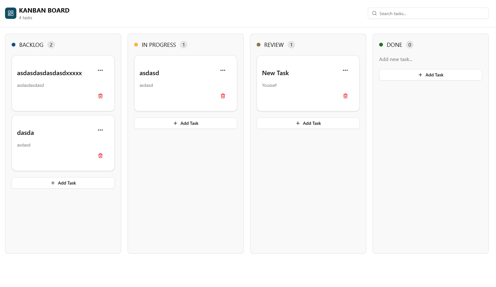

# 🗂️ Kanban Board

Frontend Assessment Project for **Mind Luster**

A modern Kanban Board application built with Next.js and modern frontend tools.  
The project demonstrates clean architecture, state management, drag & drop, and API integration.

---

## 🚀 Tech Stack

- Next.js v16
- TypeScript
- TailwindCSS
- Redux Toolkit (RTK)
- RTK Query
- shadcn/ui
- dnd-kit
- json-server (Mock API)

---

## 📸 Project Preview



---

## ⚙️ How To Run The Project

### 1️⃣ Clone the repository

```bash
git clone <https://github.com/YoussefTurkey11/kanban-board.git>
cd kanban-board
```

### 2️⃣ Install dependencies

```bash
npm install
```

### 3️⃣ Run the mock API (json-server)

```bash
npm run server
```

### 4️⃣ Run the frontend development server

```bash
npm run dev
```

### Now open:

```bash
http://localhost:3000
```

## 🏗️ Architecture

The project follows a Component-Based Architecture
with clean separation of concerns and scalable folder structure.

```
src/
│
├── app/
│
├── components/
│   ├── kanban/
│   │   ├── Board
│   │   ├── Column
│   │   ├── CreateTaskDialog
│   │   ├── EditTaskDialog
│   │   └── TaskCard
│   │
│   ├── layout/
│   │   └── Header
│   │
│   └── shared/
│       ├── Logo
│       └── Search
│
├── hooks/
│   ├── useColumnTask
│   └── useDebounce
│
├── redux/
│   ├── store
│   ├── provider
│   ├── baseApi
│   │
│   ├── slices/
│   │   └── uiSlice
│   │
│   └── apis/
│       └── taskApi
```

## ✨ Features

- Create, Edit, Delete Tasks
- Drag & Drop between columns
- Column-based filtering
- Search functionality
- Infinit scrolling
- Optimized state management with RTK Query
- Clean UI with shadcn components

## 🎯 Purpose

This project was built as a technical assessment for Mind Luster
to demonstrate frontend architecture, clean code practices, and state management skills.

##### Youssef El-Turkey

##### Frontend Developer
